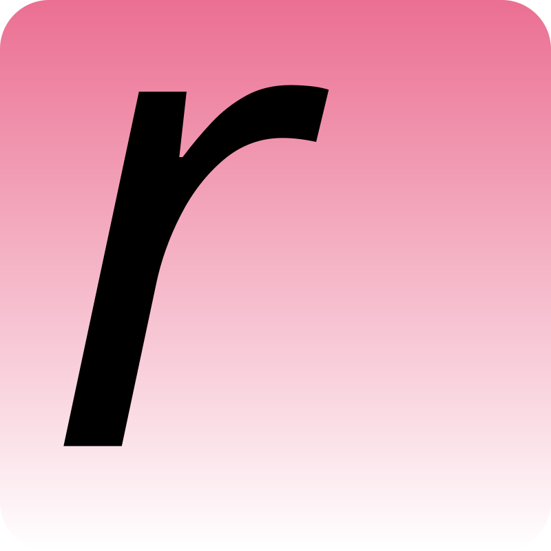
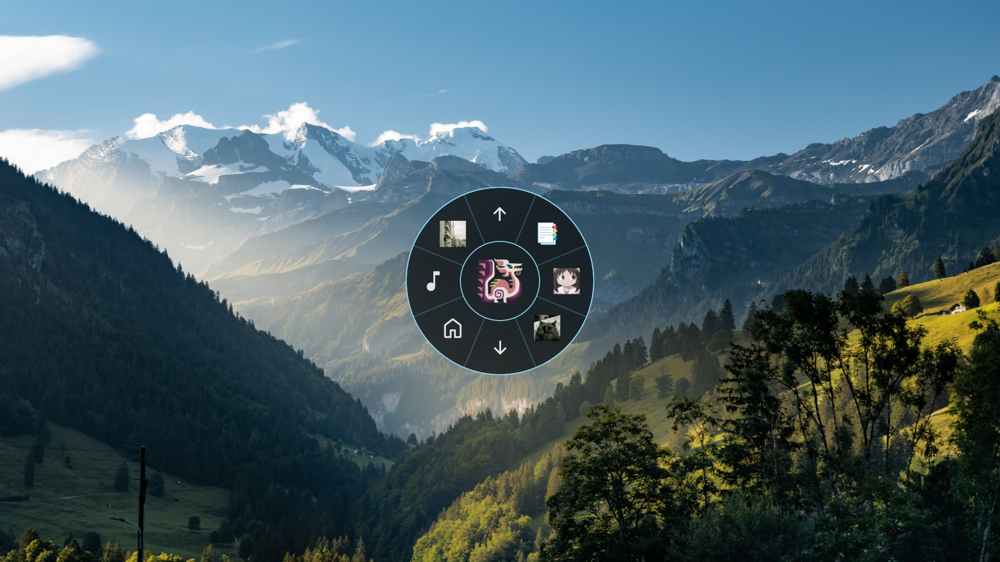
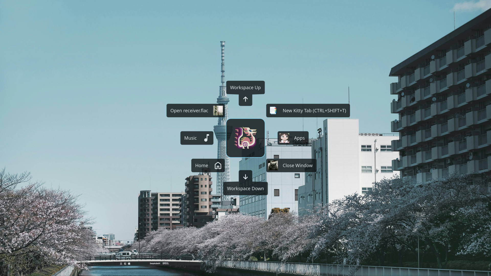
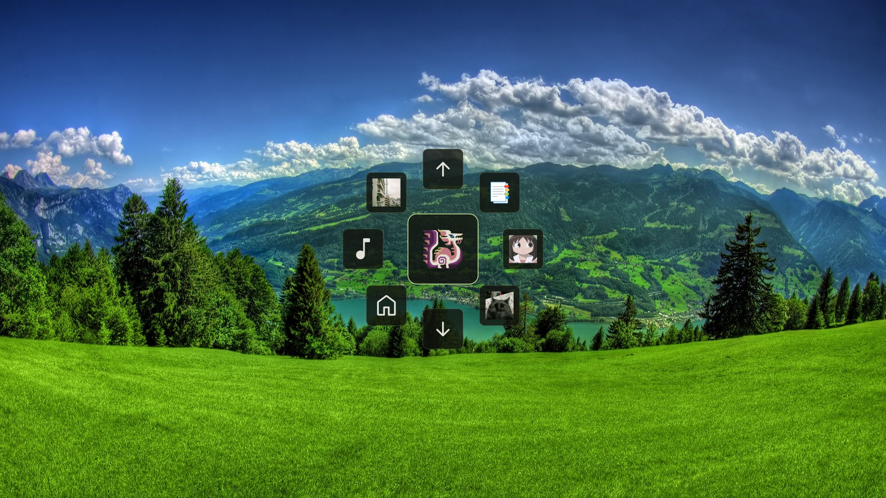

#### Special thanks to the contributors of Kando (https://github.com/kando-menu/kando), which was the main inspiration behind this project.

#### WARNING!: Code heavily generated by AI, works pretty well on my end but it may not on yours, please be aware of this.

#  mwk

rmwk is a fast, lightweight, and highly customizable native radial app launcher designed for Wayland compositors (such as Niri, Hyprland or Sway).\
Primarily made as a quicker-to-open and simpler alternative to Kando, a similar project which I have taken a lot of inspiration from.

## Features

- **Native**: Built directly on Wayland protocols (wlr-layer-shell) and rendered in GTK4 via Hardware Acceleration.
- **Daemon Design**: Init the daemon and then launch your menus or launch any menu to trigger the daemon initialization (First launch of any menu takes a bit longer because of caching).
- **Config as Code**: A simple TOML format defines the circular structure.
- **Runtime CSS Themes**: Hot-swappable stylesheets without recompilation or restart.
- **Keyboard Navigation**: Full support for mouse-less operation using Tab, Arrow Keys or Quick Select Keys.
- **Submenu Traversal**: Seamless folder structures, with automatic circular "Back" slices.
- **Built-in GUI Editor**: Launch with `rmwk settings` to manage menu items, icons, and themes graphically.
    - **Entries**: Add your own commands, submenus, links/URIs, keyboard shortcuts and files/folders from the same interface.
    - **Menu Styles**: Choose between 3 menu styles.
    - **Icons**: Use material symbols, system's icon theme or your own images as icons for entries on your menus.
    - **Several QoL options**: Spawn at center, marking mode (a bit awkward as of now), breadcrumbs, etc; all optional.
    - **Themes**: Select and create new colorschemes you can use.
    - And more (⌒ω⌒)ﾉ **!**
- **Tray**: Tray icon to open settings or kill the daemon.

## Interaction & Navigation

| Input Event                                   | Action                              |
| --------------------------------------------- | ----------------------------------- |
| **Esc / Click Outside**                       | Close                               |
| **Right-Click / Click Hub / Backspace**       | Go back to parent menu              |
| **Tab** / **Down Arrow** / **Right Arrow**    | Cycle forward through wedges        |
| **Shift+Tab** / **Up Arrow** / **Left Arrow** | Cycle backward through wedges       |
| **Alt+Left or Right / Mouse Side Buttons**    | Back / forward through menu history |
| **Left-Click** / **Return** / **Space**       | Execute action or enter submenu     |

---

## How it looks

### Showcase

### Sreenshots

---

#### Pie Mode



#### Floating Entries Mode



#### Floating Icons Mode



## Installation & Compilation

### Dependencies

Ensure you have **GTK4** and **gtk4-layer-shell** installed on your system.

On Arch Linux:

```bash
sudo pacman -S gtk4 gtk4-layer-shell
```

### Build

```bash
cargo build --release
```

The compiled binary will be located at `target/release/rmwk`.

### Add to PATH

Create a symbolic link to ~/.local/bin

```bash
ln -s /full/path/to/project_dir/target/release/rmwk ~/.local/bin/rmwk
```

You may have to add "~/.local/bin" to your PATH depending on your shell though!

### Files the app writes outside `~/.config/rmwk`

So the tray and window icons resolve in icon-theme-aware shells, rmwk quietly
installs the following on first run:

- `~/.local/share/icons/hicolor/scalable/apps/rmwk.svg` — the app logo, used by the system tray icon (written by both the daemon and the settings app)
- `~/.local/share/applications/rmwk.settings.desktop` — a desktop entry for the settings window (written when the settings app runs), which is how Wayland compositors and bars map the `rmwk.settings` window to its icon

Both live in user-owned dirs, and are rewritten on each launch; delete them
freely if you don't want them.

## Usage & Startup Modes

```bash
# Start the daemon
rmwk

# Open a menu (e.g. apps.toml from ~/.config/rmwk/menus/)
# apps.toml and Apps.toml are different
rmwk open apps
# or
rmwk open "apps"

# Open the GUI settings editor
rmwk settings

# Hot-reload themes and menu config on a running instance
rmwk reload
```

## Compositor Setup

Bind the launcher to a hotkey in your compositor config:

### 1. Niri (config.kdl)

```kdl
binds {
    Alt+Q { spawn-sh "/path/to/rmwk open menu" }
}
```

### 2. Hyprland (hyprland.lua)

```lua

hl.bind("ALT + Q", hl.dsp.exec_cmd("/path/to/rmwk open menu"))
```

## Customization

Config files are automatically generated on first launch under:

- Default Menu: `~/.config/rmwk/menus/menu.toml`
- UI Configuration: `~/.config/rmwk/config.toml`
- Custom Themes: `~/.config/rmwk/themes/`

### Example `~/.config/rmwk/menus/menu.toml`

```toml
# Icon shown in the hub while this menu is open
icon = "apps"

[[menu]]
label = "Apps"
icon = "apps"          # Material Symbols name
quick_select_key = "a" # press the key while the menu is open to jump here

    [[menu.children]]
    label = "Terminal"
    icon = "/home/me/Pictures/terminal.png"      # absolute path = custom image icon
    action = { type = "command", cmd = "kitty" }

    [[menu.children]]
    label = "Browser"
    icon = "sys:firefox"                           # "sys:" forces your system icon theme
    action = { type = "command", cmd = "firefox" }

    [[menu.children]]
    label = "Open Gmail"
    icon = "mail"
    action = { type = "open_uri", uri = "https://mail.google.com" }

[[menu]]
label = "Workspace"
icon = "🪟"          # single characters and emoji work too

    [[menu.children]]
    label = "Next Workspace"
    icon = "arrow_forward"
    # hotkeys are injected with wtype; keep_open leaves the menu on screen
    action = { type = "hotkey", keys = "ctrl+alt+l", keep_open = true }

[[menu]]
label = "System"
icon = "settings"

    [[menu.children]]
    label = "Documents"
    icon = "folder_open"
    action = { type = "open_path", path = "~/Documents" }

    [[menu.children]]
    label = "Reboot"
    icon = "restart_alt"
    action = { type = "command", cmd = "systemctl reboot" }
```

### Example `config.toml`

```toml
[ui]
theme = "gruvbox"              # Loads themes/gruvbox.css
font = "Adamina"               # Labels and text icons (size comes from Scale)
menu_style = "pie"             # "pie", "floating" or "floating-icons"
scale = 1.0
extra_radius = 50.0            # Extra clickable margin around the wedges (px)
pill_roundness = 1.0           # Floating styles: 1.0 = capsules, 0.0 = sharp
enable_pie_spacing = false     # Auto-grow the hub-to-ring gap in pie mode
use_symbolic_icons = false     # Prefer symbolic variants of system icons
bold_single_chars = true
center_layout = false          # Rotate wedges so they sit centered on axes
hide_back_entry = false
disable_hover_animation = false
hover_visual_cue = "outwards"  # "outwards", "sides" or "none"
enable_blur = true             # Pie style only, needs ext-background-effect-v1
spawn_at_cursor = true         # Open the menu at the mouse pointer
marking_mode = false           # Hold & drag: dwell over a folder to enter it
marking_dwell_ms = 180         # Dwell time (ms) before it auto-triggers
submenu_shift = false          # Non-anchored: submenus drift where you clicked
show_breadcrumbs = true        # Breadcrumb badges (needs submenu_shift)
settings_hotspot_corner = "none"  # Invisible corner that opens settings:
                                  # "none", "top-left", "top-right",
                                  # "bottom-left", "bottom-right"
```
